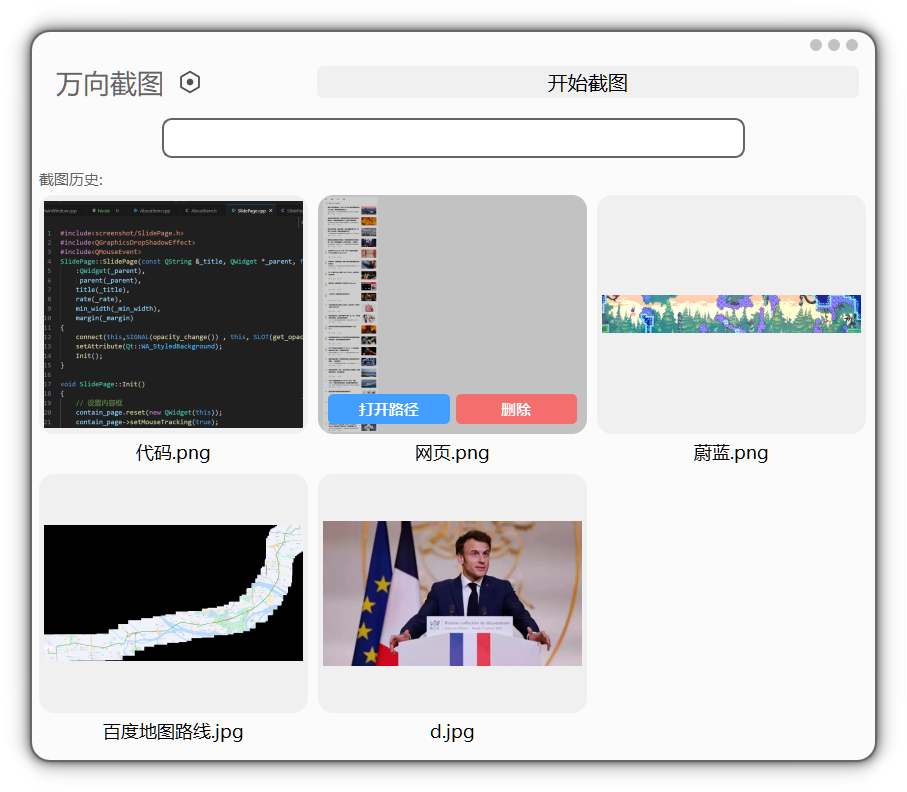
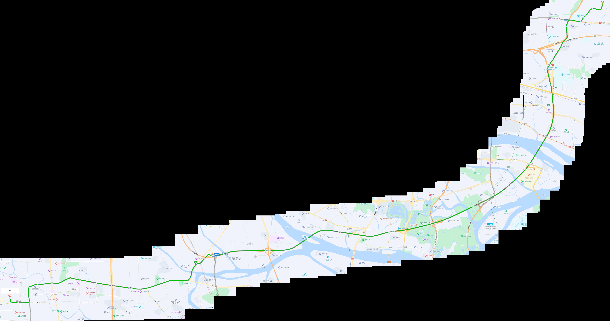

# 基于Qt与Opencv的任意方向截图软件

由于现在的截图软件不支持**左右**与**滑动**截图，而且一截图就直接限制我其他区域的动作的（点名qq的截图，不让我滑条，只能滚轮），这样就无法做到下面的需求

* 左右截图（笔记本的屏幕太小而有一些网页又太大）
* 滑动截图（百度地图要放大才能看到这条路是什么，要截路线图、还有一些涂鸦工具截图）
* 游戏地图合成（2D游戏地图生成，要告诉别人收集点在哪）

**因此本项目想解决这些痛点，而且练练手**

# 下载

exe：

# 亮点

✅ 界面漂亮，无框界面，而且做了很多动画，使用css表和QPropertyAnimation

✅ 基于Qt框架的信号与槽机制，甚至很方便地跨线程传输，直接将UI线程与截图线程分离，解耦代码

✅基于Opencv的sift特征计算位移距离，实现多图拼合以达到任意方向长截图的目标

✅ 适配所有的电脑放大系数，我笔记本125%放大系数和显示器100%的系数都适用

✅ 基于cmake的静态编译，就只有一个exe（虽然违反Qt开源协议）

# 界面展示



## 截图gif演示

gif有点大，就不放在readme里了，在[这里](Readme.assets/功能.gif)


# 长截图效果展示

# 蔚蓝

某一关的地图


## 百度地图

路线是从广州华工到佛山祖庙




# 编译

```
是静态编译，需要先编译好静态的qt与opencv
cmake -B build -DCMAKE_PREFIX_PATH="【qt与opencv静态编译好的路径】"
cmake --build build
./build/screenshot.exe
```

